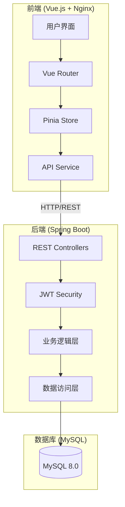
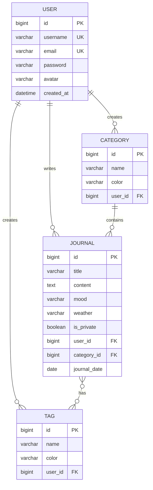

# 🚀 Personal Journal - 个人日记应用

> **记录生活的每一个瞬间，让每一天都值得回忆**

一个商业级的个人日记记录全栈应用，采用 Spring Boot 后端 + Vue.js 前端，支持 Docker 一键部署。

---

## 📐 系统架构



---

## 💾 数据库设计



---

## 🛠 技术栈

| 层级 | 技术 |
|------|------|
| **Frontend** | Vue.js 3 + Vite + Pinia + Vue Router |
| **Backend** | Spring Boot 3 + Spring Security + JPA |
| **Database** | MySQL 8.0 |
| **Authentication** | JWT Token |
| **Containerization** | Docker + Docker Compose |

---

## 🚀 快速启动 (Docker)

### 前置条件
- Docker Desktop 已安装并运行

### 启动步骤

```bash
# 1. 进入项目根目录

# 2. 一键启动所有服务
docker compose up --build

# 3. 等待所有服务启动完成（约3-5分钟）
```

### 访问地址

| 服务 | 地址 |
|------|------|
| 🌐 **前端应用** | http://localhost:3000 |
| 📡 **后端 API** | http://localhost:8000 |
| 📚 **API 文档** | http://localhost:8000/swagger-ui.html |
| 🗄️ **数据库** | localhost:3306 |

---

## 🧪 测试账号

首次使用请先注册新账号，或使用以下测试流程：

1. 访问 http://localhost:3000
2. 点击"立即注册"
3. 填写用户名、邮箱、密码
4. 注册成功后自动登录

---

## 📷 功能介绍

### 核心功能

| 功能 | 描述 |
|------|------|
| ✅ 用户认证 | 注册、登录、JWT 令牌认证 |
| 📝 日记管理 | 创建、编辑、删除、搜索日记 |
| 📂 分类管理 | 自定义分类，整理日记 |
| 🏷️ 标签管理 | 多标签支持，灵活分类 |
| 📊 仪表板 | 统计数据、心情分析、连续写作天数 |
| 🎨 心情记录 | 8种心情状态可选 |
| ☀️ 天气记录 | 6种天气状态可选 |
| 🔒 隐私保护 | 支持私密日记设置 |

### 界面特点

- 🎨 现代简约设计风格
- 📱 响应式布局，支持 PC 和移动端
- ✨ 流畅的动画效果和交互反馈
- 🌓 支持浅色主题

---

## 📁 项目结构

```
Project_Root/
├── README.md                    # 项目文档
├── docker-compose.yml           # Docker 编排
├── backend/                     # Spring Boot 后端
│   ├── Dockerfile
│   ├── pom.xml
│   └── src/main/java/com/journal/
│       ├── JournalApplication.java
│       ├── config/              # 配置类
│       ├── controller/          # 控制器
│       ├── entity/              # 实体类
│       ├── repository/          # 数据访问
│       ├── service/             # 业务逻辑
│       ├── dto/                 # 数据传输对象
│       ├── exception/           # 异常处理
│       └── security/            # 安全配置
├── frontend/                    # Vue.js 前端
│   ├── Dockerfile
│   ├── nginx.conf
│   ├── package.json
│   └── src/
│       ├── main.js
│       ├── App.vue
│       ├── router/              # 路由
│       ├── stores/              # 状态管理
│       ├── services/            # API 服务
│       ├── layouts/             # 布局组件
│       ├── views/               # 页面组件
│       └── styles/              # 样式
└── mysql/                       # 数据库初始化
    └── init.sql
```

---

## 🔧 专业工程实践

### 1. 日志系统
- 使用 SLF4J + Logback 统一日志管理
- 按日志级别分类（INFO, DEBUG, WARN, ERROR）
- 关键操作完整记录审计日志

### 2. 错误处理
- 全局异常处理器 `GlobalExceptionHandler`
- 统一错误响应格式 `ApiResponse`
- 业务异常类 `BusinessException` 细分错误类型

### 3. 数据校验
- 使用 `@Valid` 注解进行参数校验
- 自定义校验消息，友好提示
- 前后端双重验证

### 4. 接口设计
- RESTful API 规范
- 统一响应格式 `{ code, message, data, timestamp }`
- Swagger/OpenAPI 文档自动生成

### 5. 生产级特性

| 特性 | 状态 |
|------|------|
| 响应式设计 | ✅ |
| 数据持久化 | ✅ |
| 模块化架构 | ✅ |
| JWT 认证 | ✅ |
| CORS 配置 | ✅ |
| 健康检查 | ✅ |
| Docker 容器化 | ✅ |
| 数据库连接池 | ✅ |

---

## 🛑 停止服务

```bash
# 停止所有服务
docker compose down

# 停止并删除数据卷（清除数据库）
docker compose down -v
```

---

## 📄 License

MIT License © 2026 Personal Journal
